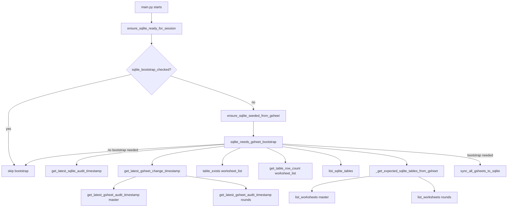
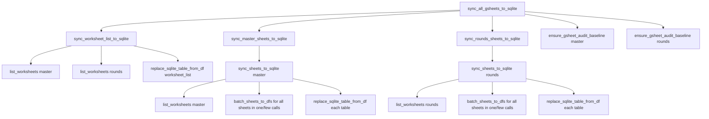
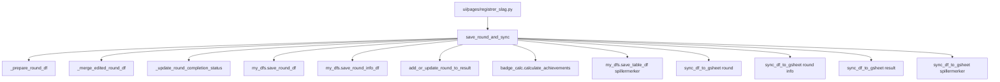

# Google Sheets Call Flow

This document shows the main call paths and why they happen.

## 1. App startup and bootstrap

### Why these calls happen

1. Hovedpunkt: Avgjør om bootstrap trengs.
Underpunkt: `get_latest_sqlite_audit_timestamp` sjekker om SQLite har synk-historikk.
Underpunkt: `get_latest_gsheet_change_timestamp` sjekker om Google Sheets er nyere enn SQLite.

2. Hovedpunkt: Verifiser at lokal speiling er komplett nok.
Underpunkt: `list_sqlite_tables`, `table_exists`, `get_table_row_count` sjekker lokal struktur.
Underpunkt: `list_worksheets` på master og rounds sjekker hvilke ark som finnes i Google Sheets.

3. Hovedpunkt: Start full synk hvis data er stale eller mangelfull.
Underpunkt: Hvis kontrollene over feiler eller viser avvik, kalles `sync_all_gsheets_to_sqlite`.

## 2. Full sync path

### Why these calls happen

1. Hovedpunkt: Bygg metadataindeks over ark.
Underpunkt: `sync_worksheet_list_to_sqlite` lagrer kun liste over ark (ikke innhold).

2. Hovedpunkt: Synk faktisk innhold fra Google Sheets til SQLite.
Underpunkt: `sync_master_sheets_to_sqlite` og `sync_rounds_sheets_to_sqlite` orkestrerer hver sin kilde.
Underpunkt: `batch_sheets_to_dfs` henter alle ark i en kilde med `values.batchGet` i grupper på `BATCH_READ_CHUNK_SIZE` (15) ark per kall, i stedet for ett `sheet_to_df`-kall per ark.
Underpunkt: `replace_sqlite_table_from_df` skriver den leste DataFrame-en til riktig SQLite-tabell.

3. Hovedpunkt: Sikre audit-baseline for neste sammenligning.
Underpunkt: `ensure_gsheet_audit_baseline` sørger for at audit-grunnlaget finnes for senere diff-sjekk.

## 3. Saving a round from the UI

### Why these calls happen

1. Hovedpunkt: Valider og bygg lagringsklar runde.
Underpunkt: Første blokk normaliserer input og merger endringer i forventet skjema.

2. Hovedpunkt: Lagre lokalt i SQLite først.
Underpunkt: SQLite er lokal source of truth i app-flyten.

3. Hovedpunkt: Oppdater avledede data.
Underpunkt: Resultat og achievements beregnes på nytt basert på siste lagrede runde.

4. Hovedpunkt: Speil tilbake til Google Sheets.
Underpunkt: Fire `sync_df_to_gsheet`-kall pusher round, round info, result og spillermerker.

## 4. Estimated Google Sheets call count

Dette er et praktisk estimat av antall Google Sheets-kall per flyt.

1. Startup check uten full bootstrap.
Underpunkt: Ca 4 read-kall som baseline.
Underpunkt: 2 kall fra `get_latest_gsheet_audit_timestamp` (master + rounds).
Underpunkt: 2 kall fra `list_worksheets` (master + rounds).

2. Full bootstrap/sync.
Underpunkt: Fast del: ca 6 read-kall.
Underpunkt: 2 kall i `sync_worksheet_list_to_sqlite` (`list_worksheets` master + rounds).
Underpunkt: 2 kall i `sync_master_sheets_to_sqlite`/`sync_rounds_sheets_to_sqlite` for worksheet-lister.
Underpunkt: Inntil 2 kall i `ensure_gsheet_audit_baseline` (master + rounds) for audit-kolonne-lesing.
Underpunkt: Variabel del: `ceil(N_master / 15) + ceil(N_rounds / 15)` read-kall fra `batch_sheets_to_dfs` (ett kall per 15 worksheets, i stedet for ett kall per worksheet).
Underpunkt: Total grovt: `6 + ceil(N_master / 15) + ceil(N_rounds / 15)` read-kall.

3. Lagring fra UI (`save_round_and_sync`).
Underpunkt: 4 write-kall til Google Sheets via `sync_df_to_gsheet`.
Underpunkt: Ekstra audit-kall skjer ved skriving (append til audit-log), men de er write-kall, ikke read-kall.

## 5. Where the quota pressure comes from

The quota pressure is mostly caused by read operations, not writes:

- startup bootstrap calls audit reads before the user even reaches the app
- full sync lists worksheets for master and rounds
- full sync reads each worksheet through `batch_sheets_to_dfs` (batched, but still one call per 15 sheets)
- audit-baseline checks may touch Google Sheets again after sync

In practice, the biggest repeat offenders are:

- `list_worksheets`
- `batch_sheets_to_dfs`
- `get_latest_gsheet_audit_timestamp`
- `ensure_gsheet_audit_baseline`

## 6. Improvement ideas

1. Cache bootstrap decisions per session.
Underpunkt: Appen markerer bootstrap i session state, men cold start treffer fortsatt flere sjekk-kall.

2. Keep audit-baseline best-effort.
Underpunkt: Audit er nyttig, men skal ikke blokkere appen ved quota.

3. Reduce repeated worksheet discovery.
Underpunkt: Lagre sist kjente worksheet-liste lokalt og refresh bare ved behov.

4. Split bootstrap into a lighter path.
Underpunkt: Kjør billig lokal sjekk først, og gå til Google Sheets kun når lokal state virker stale.

5. Make sync more explicit.
Underpunkt: Egen admin-knapp for "sync now" kan redusere automatisk startup-trafikk.

6. Avoid rereading the same sheet in one run.
Underpunkt: Neste steg er å sende videre allerede lastet worksheet-data i pipeline.

## 7. Short summary

- Startup decides whether SQLite needs a refresh.
- If yes, the app does a full Google Sheets -> SQLite sync.
- Round saving writes to SQLite first, then mirrors back to Google Sheets.
- Quota issues come from repeated reads, especially audit and worksheet discovery calls.
- The next wins are cheaper bootstrap checks and fewer reads during startup.
